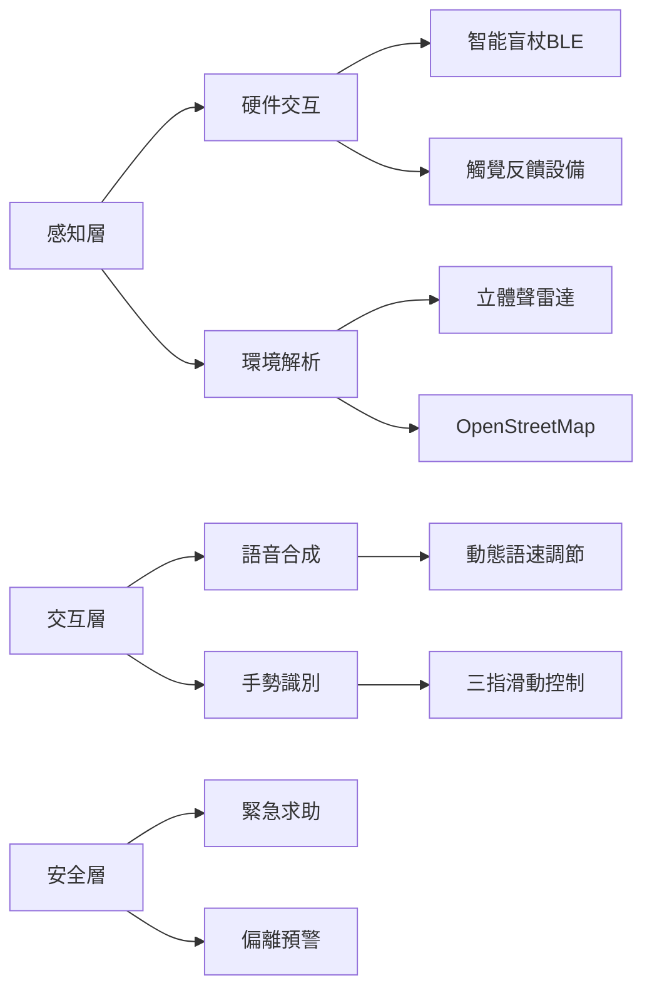
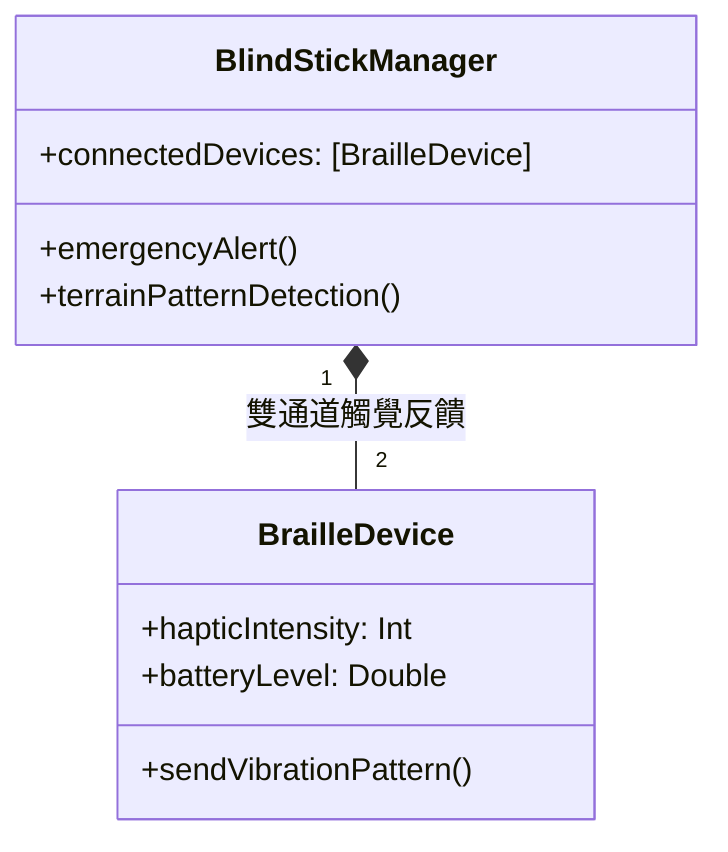
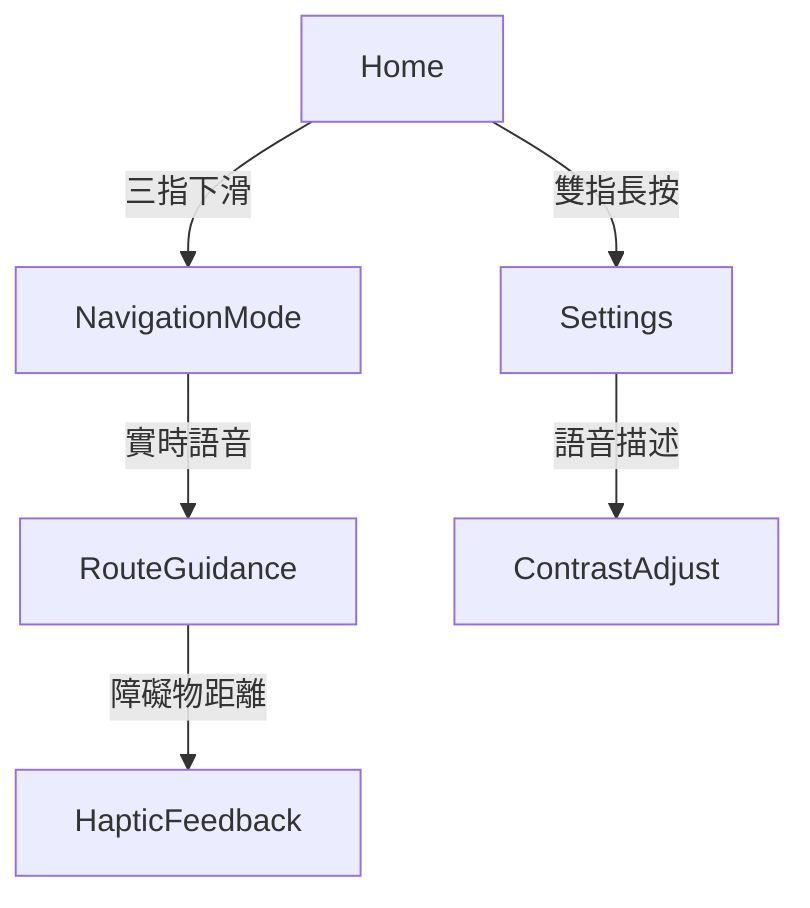

# BlindApp Sample (Unfinished)

## 簡介
BlindApp 是一款專為視障人士設計的 iOS 應用，提供語音輸入、語音回饋和簡化的交互界面。

## 功能
- VoiceOver 支援
- 按鍵震動和音效提示

## 文件結構
- `App/`: 主應用代碼
- `Tests/`: 單元測試代碼
- `Resources/`: 圖片、音效等資源文件


# Invisible Travel - 盲人出行智能助手


## 🌐 項目
**觸覺導航伴侶**專為視障人士設計的全方位出行輔助工具，整合六大核心感知系統：


## 🦯 關鍵技術架構
### 無障礙系統設計


### 無障礙技術棧
```swift
struct AccessibilityTech {
    let coreServices = ["CoreBluetooth", "AVSpeechSynthesis", "CoreMotion"]
    let navComponents = ["ARKit障礙檢測", "ML聲音識別", "觸覺編碼協議"]
    let uiSpec = ["WCAG 2.1 AA", "動態字體縮放", "語音優先設計"]
}
```

## 🎧 核心功能模塊
### 智能盲杖連接系統（BLECore.swift）


#### 觸覺編碼協議
```swift
enum TerrainPattern: Int, CaseIterable {
    case flatGround = 0    // 持續震動
    case stairsUp = 1      // 短-長脈衝
    case obstacle = 2      // 三連急促震動
    case crosswalk = 3     // 交替左右震動
}
```

### 語音導航界面（ContentView.swift）
#### 無障礙交互流程


#### 語音指令系統
```swift
struct VoiceCommand: View {
    @EnvironmentObject var navEngine: NavigationEngine
  
    var body: some View {
        Button(action: startNavigation) {
            Text("開始導航")
                .accessibilityHint("雙指雙擊激活，長按取消")
                .accessibilityAction(.magicTap) {
                    navEngine.repeatLastInstruction()
                }
        }
    }
}
```

## 🚦 安全與無障礙設計
### 關鍵安全機制
markdown
1. **緊急制動協議**
   - 盲杖劇烈晃動觸發SOS
   - 自動發送定位至緊急聯繫人

2. **路徑偏離預警**
   ```swift
   func checkDeviation(from route: Route) {
       if location.distance > 5.meters {
           playAlert(.reRouting)
           triggerHaptic(.strongPulse)
       }
   }
   ```

3. **環境感知增強**
   - 3D音效標記興趣點
   - 氣味傳感器集成（開發中）


### 無障礙UI規範
```swift
struct AccessibilityButton: View {
    let title: String
    @Binding var isActive: Bool
  
    var body: some View {
        Text(title)
            .accessibilityElement(children: .combine)
            .accessibilityAddTraits(.isButton)
            .accessibilityLabel("\(title)，當前狀態：\(isActive ? "啓用" : "關閉")")
            .accessibilityAction {
                isActive.toggle()
            }
    }
}
```


## 🌟 技術
1. **智能學習路徑**
   ```swift
   MLModel.predictRoute(preferences: 
       AccessibilityPreference(
           avoidStairs: true,
           preferTactileGround: true
       )
   )
   ```

