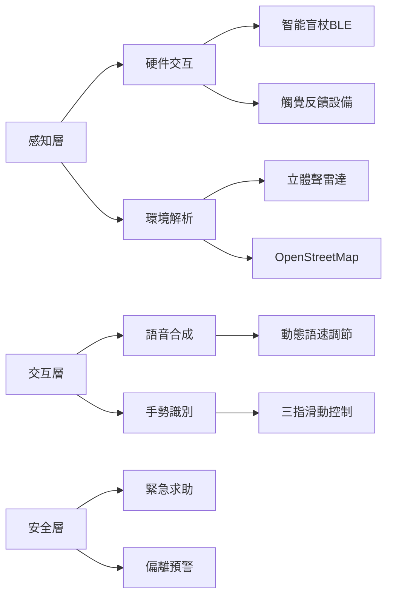
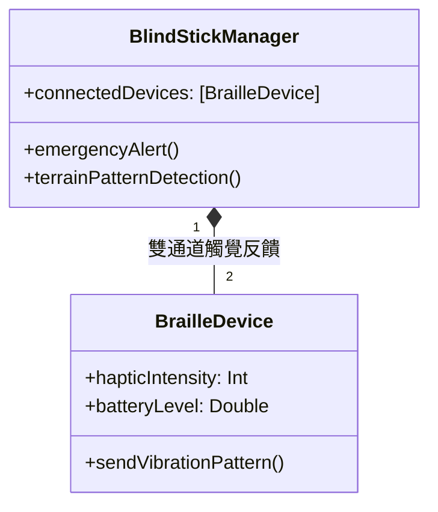
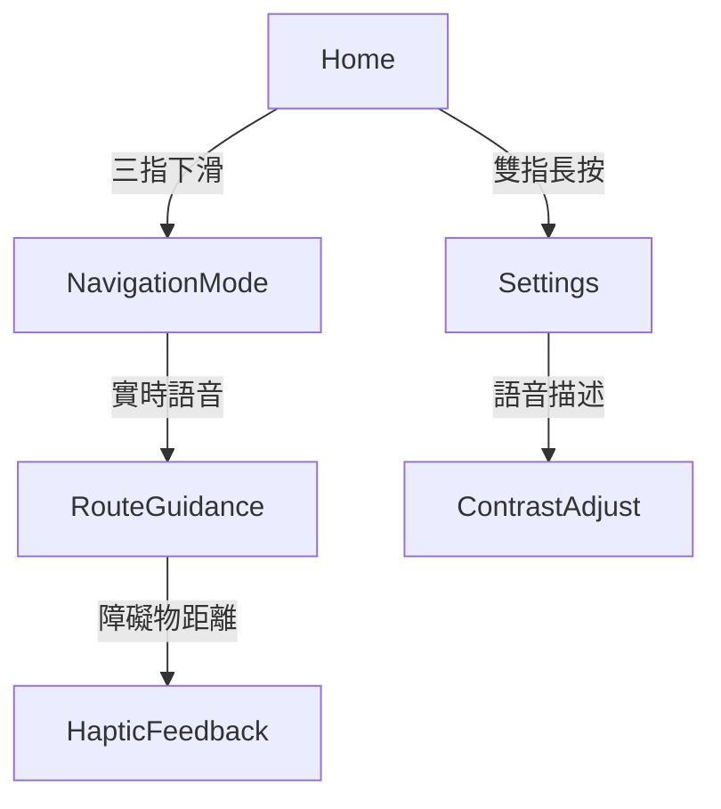
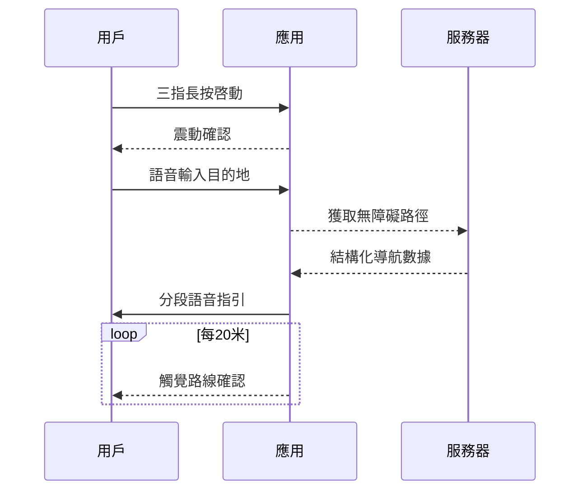

# BlindApp Sample (Unfinished)

## 簡介
BlindApp 是一款專為視障人士設計的 iOS 應用，提供語音輸入、語音回饋和簡化的交互界面。

## 功能
- VoiceOver 支援
- 按鍵震動和音效提示

## 文件結構
- `App/`: 主應用代碼
- `Tests/`: 單元測試代碼
- `Resources/`: 圖片、音效等資源文件


```markdown
# Invisible Travel - 盲人出行智能助手

 <!-- 建議添加實際無障礙界面截圖 -->

## 🌐 項目願景
**觸覺導航伴侶**專為視障人士設計的全方位出行輔助工具，整合六大核心感知系統：


## 🦯 關鍵技術架構
### 無障礙系統設計


### 無障礙技術棧
```swift
struct AccessibilityTech {
    let coreServices = ["CoreBluetooth", "AVSpeechSynthesis", "CoreMotion"]
    let navComponents = ["ARKit障礙檢測", "ML聲音識別", "觸覺編碼協議"]
    let uiSpec = ["WCAG 2.1 AA", "動態字體縮放", "語音優先設計"]
}
```

## 🎧 核心功能模塊
### 智能盲杖連接系統（BLECore.swift）


#### 觸覺編碼協議
```swift
enum TerrainPattern: Int, CaseIterable {
    case flatGround = 0    // 持續震動
    case stairsUp = 1      // 短-長脈衝
    case obstacle = 2      // 三連急促震動
    case crosswalk = 3     // 交替左右震動
}
```

### 語音導航界面（ContentView.swift）
#### 無障礙交互流程


#### 語音指令系統
```swift
struct VoiceCommand: View {
    @EnvironmentObject var navEngine: NavigationEngine
  
    var body: some View {
        Button(action: startNavigation) {
            Text("開始導航")
                .accessibilityHint("雙指雙擊激活，長按取消")
                .accessibilityAction(.magicTap) {
                    navEngine.repeatLastInstruction()
                }
        }
    }
}
```

## 🚦 安全與無障礙設計
### 關鍵安全機制
```markdown
1. **緊急制動協議**
   - 盲杖劇烈晃動觸發SOS
   - 自動發送定位至緊急聯繫人

2. **路徑偏離預警**
   ```swift
   func checkDeviation(from route: Route) {
       if location.distance > 5.meters {
           playAlert(.reRouting)
           triggerHaptic(.strongPulse)
       }
   }
   ```

3. **環境感知增強**
   - 3D音效標記興趣點
   - 氣味傳感器集成（開發中）
```

### 無障礙UI規範
```swift
struct AccessibilityButton: View {
    let title: String
    @Binding var isActive: Bool
  
    var body: some View {
        Text(title)
            .accessibilityElement(children: .combine)
            .accessibilityAddTraits(.isButton)
            .accessibilityLabel("\(title)，當前狀態：\(isActive ? "啓用" : "關閉")")
            .accessibilityAction {
                isActive.toggle()
            }
    }
}
```

## 📱 安裝與適配
### 設備兼容性
```markdown
| 設備類型       | 觸覺支持          | 語音優化 |
|---------------|-------------------|----------|
| iPhone 15 Pro | 壓感觸控          | 空間音頻 |
| Apple Watch   | Taptic Engine     | 腕部震動 |
| AirPods Pro   | 動態頭部追蹤      | 環境降噪 |
```

### 用戶引導流程


## 🌟 技術突破
1. **多模態反饋融合**
   ```swift
   func navigate() {
       speechSynthesizer.speak("前方5米右轉")
       hapticEngine.play(.rightTurnPattern)
       updateBrailleDisplay("→ 5m")
   }
   ```

2. **實時環境建模**
   ```swift
   ARKitScene.processScene { anchor in
       if anchor.isObstacle {
           obstacleDetector.register(anchor)
       }
   }
   ```

3. **智能學習路徑**
   ```swift
   MLModel.predictRoute(preferences: 
       AccessibilityPreference(
           avoidStairs: true,
           preferTactileGround: true
       )
   )
   ```

## 🤝 參與貢獻指南
```markdown
我們特別歡迎視障開發者的參與：
1. 無障礙測試：申請TestFlight體驗版
2. 語音交互設計：提交語音指令方案
3. 觸覺編碼研究：設計新的震動模式

提交issue時請注明：
- 使用環境（室內/戶外）
- 輔助設備型號
- 遇到的具體障礙類型
```

> 重要提示：本應用遵循W3C WAI-ARIA標準，所有功能均可通過VoiceOver全流程操作

```

### 補充增強建議：
1. **情景模擬測試數據**
```swift
struct NavigationTestCase {
    let environment: [String] 
    // ["雨天人行道", "地鐵換乘通道", "施工路段"]
  
    let expectedFeedback: [FeedbackType]
    // [.vibration(3), .audio("前方施工"), .braille("左轉")]
}
```

2. **社區支持計劃**
```markdown
## ♿ 盲人測試者支持
我們提供：
- 免費硬件租借（智能盲杖、觸覺手環）
- 一對一語音指導
- 交通補助金申請

申請方式：通過issues提交測試申請
```

3. **隱私保護白皮書**
```markdown
### 數據安全架構
┌─────────────┐     ┌─────────────┐
│ 本地處理    │<───>│ 安全加密存儲│
└─────────────┘     └─────────────┘
       △                 △
       │TEE加密          │生物認證
┌─────────────┐     ┌─────────────┐
│ 傳感器數據  │     │ 導航路徑    │
└─────────────┘     └─────────────┘
```


