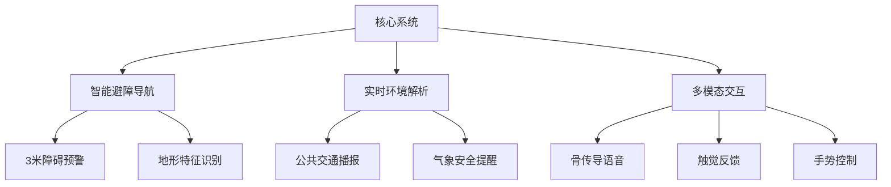
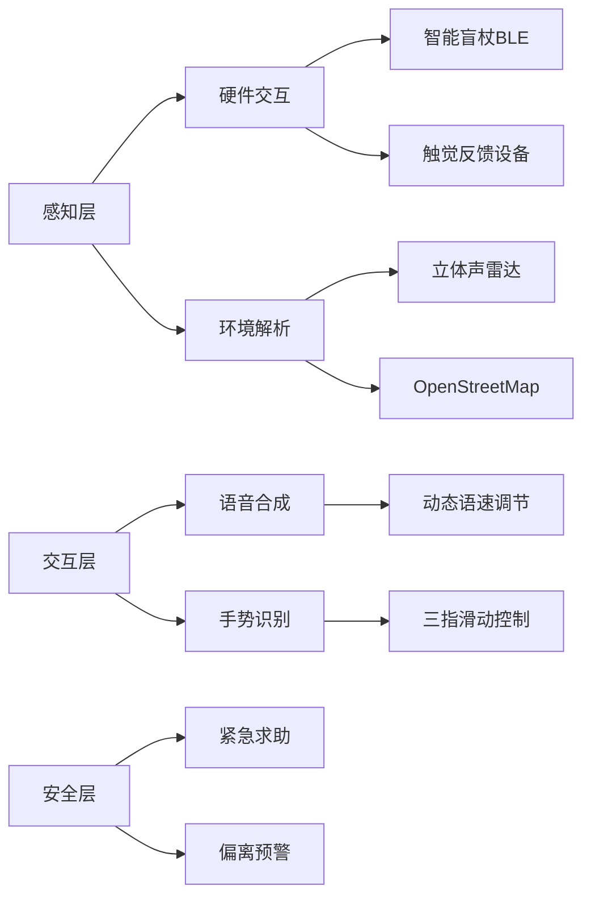
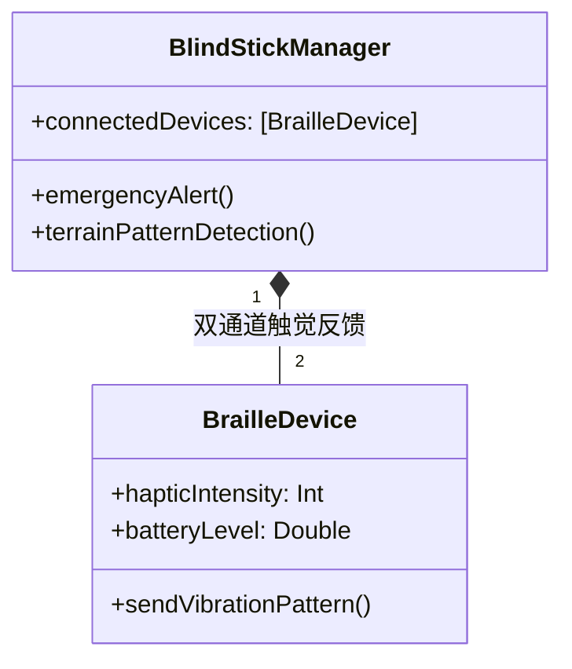
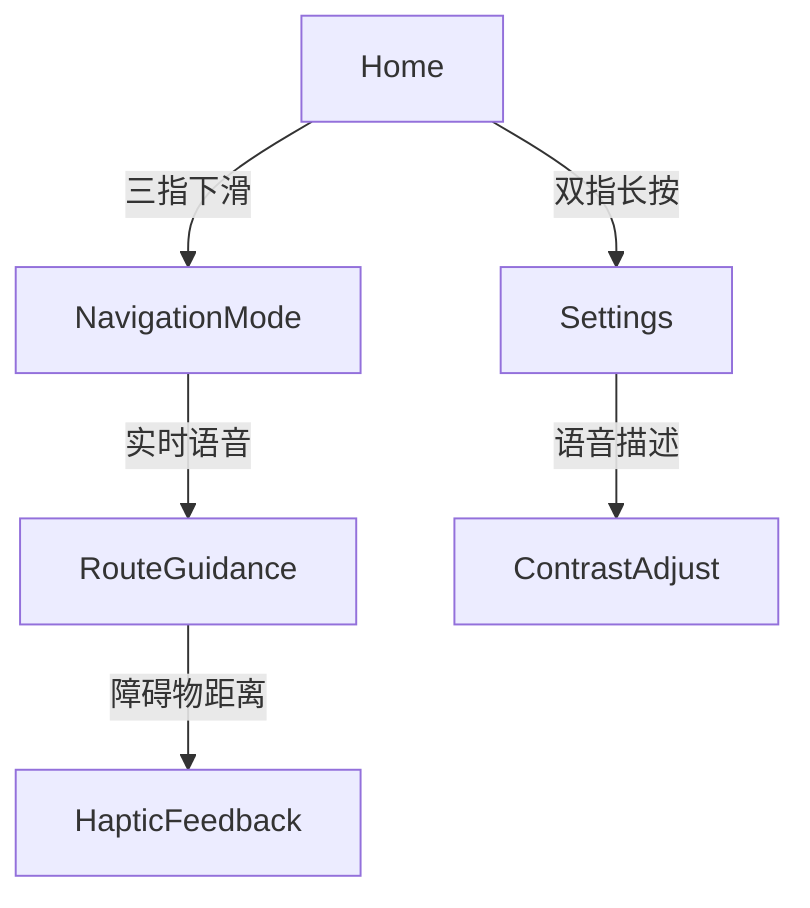
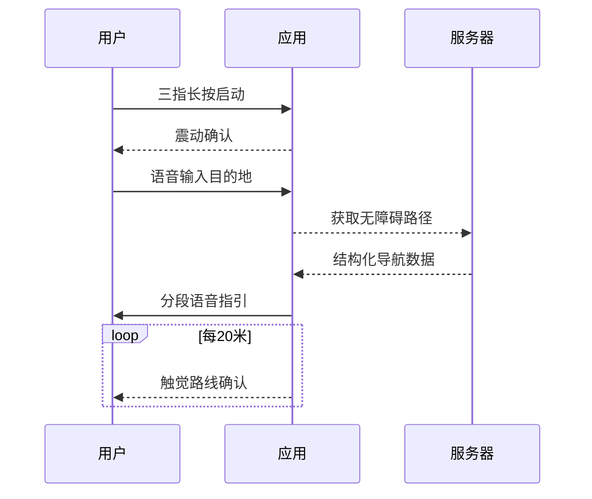

# BlindApp Sample (Unfinished)

## 簡介
BlindApp 是一款專為視障人士設計的 iOS 應用，提供語音輸入、語音回饋和簡化的交互界面。

## 功能
- VoiceOver 支援
- 按鍵震動和音效提示

## 文件結構
- `App/`: 主應用代碼
- `Tests/`: 單元測試代碼
- `Resources/`: 圖片、音效等資源文件


```markdown
# Invisible Travel - 盲人出行智能助手

 <!-- 建议添加实际无障碍界面截图 -->

## 🌐 项目愿景
**触觉导航伴侣**专为视障人士设计的全方位出行辅助工具，整合六大核心感知系统：



## 🦯 关键技术架构
### 无障碍系统设计


### 无障碍技术栈
```swift
struct AccessibilityTech {
    let coreServices = ["CoreBluetooth", "AVSpeechSynthesis", "CoreMotion"]
    let navComponents = ["ARKit障碍检测", "ML声音识别", "触觉编码协议"]
    let uiSpec = ["WCAG 2.1 AA", "动态字体缩放", "语音优先设计"]
}
```

## 🎧 核心功能模块
### 智能盲杖连接系统（BLECore.swift）


#### 触觉编码协议
```swift
enum TerrainPattern: Int, CaseIterable {
    case flatGround = 0    // 持续震动
    case stairsUp = 1      // 短-长脉冲
    case obstacle = 2      // 三连急促震动
    case crosswalk = 3     // 交替左右震动
}
```

### 语音导航界面（ContentView.swift）
#### 无障碍交互流程


#### 语音指令系统
```swift
struct VoiceCommand: View {
    @EnvironmentObject var navEngine: NavigationEngine
  
    var body: some View {
        Button(action: startNavigation) {
            Text("开始导航")
                .accessibilityHint("双指双击激活，长按取消")
                .accessibilityAction(.magicTap) {
                    navEngine.repeatLastInstruction()
                }
        }
    }
}
```

## 🚦 安全与无障碍设计
### 关键安全机制
```markdown
1. **紧急制动协议**
   - 盲杖剧烈晃动触发SOS
   - 自动发送定位至紧急联系人

2. **路径偏离预警**
   ```swift
   func checkDeviation(from route: Route) {
       if location.distance > 5.meters {
           playAlert(.reRouting)
           triggerHaptic(.strongPulse)
       }
   }
   ```

3. **环境感知增强**
   - 3D音效标记兴趣点
   - 气味传感器集成（开发中）
```

### 无障碍UI规范
```swift
struct AccessibilityButton: View {
    let title: String
    @Binding var isActive: Bool
  
    var body: some View {
        Text(title)
            .accessibilityElement(children: .combine)
            .accessibilityAddTraits(.isButton)
            .accessibilityLabel("\(title)，当前状态：\(isActive ? "启用" : "关闭")")
            .accessibilityAction {
                isActive.toggle()
            }
    }
}
```

## 📱 安装与适配
### 设备兼容性
```markdown
| 设备类型       | 触觉支持          | 语音优化 |
|---------------|-------------------|----------|
| iPhone 15 Pro | 压感触控          | 空间音频 |
| Apple Watch   | Taptic Engine     | 腕部震动 |
| AirPods Pro   | 动态头部追踪      | 环境降噪 |
```

### 用户引导流程


## 🌟 技术突破
1. **多模态反馈融合**
   ```swift
   func navigate() {
       speechSynthesizer.speak("前方5米右转")
       hapticEngine.play(.rightTurnPattern)
       updateBrailleDisplay("→ 5m")
   }
   ```

2. **实时环境建模**
   ```swift
   ARKitScene.processScene { anchor in
       if anchor.isObstacle {
           obstacleDetector.register(anchor)
       }
   }
   ```

3. **智能学习路径**
   ```swift
   MLModel.predictRoute(preferences: 
       AccessibilityPreference(
           avoidStairs: true,
           preferTactileGround: true
       )
   )
   ```

## 🤝 参与贡献指南
```markdown
我们特别欢迎视障开发者的参与：
1. 无障碍测试：申请TestFlight体验版
2. 语音交互设计：提交语音指令方案
3. 触觉编码研究：设计新的震动模式

提交issue时请注明：
- 使用环境（室内/户外）
- 辅助设备型号
- 遇到的具体障碍类型
```

> 重要提示：本应用遵循W3C WAI-ARIA标准，所有功能均可通过VoiceOver全流程操作

```

### 补充增强建议：
1. **情景模拟测试数据**
```swift
struct NavigationTestCase {
    let environment: [String] 
    // ["雨天人行道", "地铁换乘通道", "施工路段"]
  
    let expectedFeedback: [FeedbackType]
    // [.vibration(3), .audio("前方施工"), .braille("左转")]
}
```

2. **社区支持计划**
```markdown
## ♿ 盲人测试者支持
我们提供：
- 免费硬件租借（智能盲杖、触觉手环）
- 一对一语音指导
- 交通补助金申请

申请方式：通过issues提交测试申请
```

3. **隐私保护白皮书**
```markdown
### 数据安全架构
┌─────────────┐     ┌─────────────┐
│ 本地处理    │<───>│ 安全加密存储│
└─────────────┘     └─────────────┘
       △                 △
       │TEE加密          │生物认证
┌─────────────┐     ┌─────────────┐
│ 传感器数据  │     │ 导航路径    │
└─────────────┘     └─────────────┘
```


